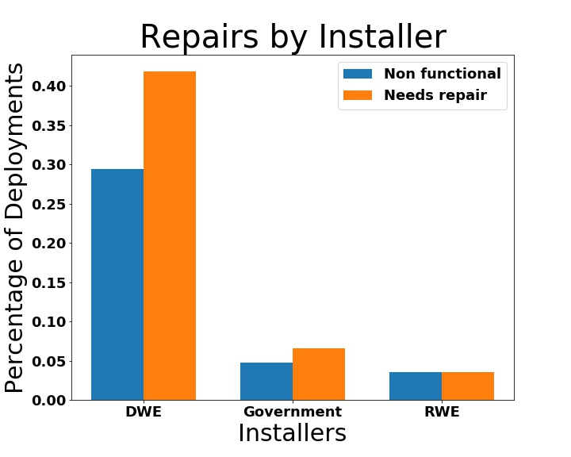

</a>

# pump\_it\_up
DrivenData competition for categorical encoding and decision tree modeling.  [DrivenData: Tanzanian Wells](https://www.drivendata.org/competitions/7/pump-it-up-data-mining-the-water-table)

## Context

Tanzania is a vast east African country with a geographically dispersed population. It is known for agricultural, mining, fishing, and tourism (Africa's tallest mountain Kilimanjaro) as major economic drivers. In order to support these activities, the Tanzanian Ministry of Water installed water wells in numerous locations. 

This project addresses the prediction of failed wells in order to help Ten Ministry with the maintenance and long-term care of these valuable water sources. 

## Table of Contents

- [Context](#Context)
- [Content](#Content)
- [Analysis](#Analysis)
- [Illustrations](#Illustrations)
- [Recommendations](#Recommendations)
- [Data Sources](#Data-Sources)
- [Next steps](#Next-steps)

## Content

The data collected is mostly catagorical and downloaded from the DrivenData website, [Pump it Up: Data Mining the Water Table](https://www.drivendata.org/competitions/7/pump-it-up-data-mining-the-water-table/data/).

As this was a competition, DrivenData did not release the 'y_test' data.  As a result, I split the training data that they provided into test and train data.  I started with 60,000 rows and 40 features.  Those features were independently encoded and added to the vanilla models, analyzed, and then included in the MVP if there was a positive effect.

## Analysis

I trimmed the feature set down tremendously, due to overlap of information and correlation to one another.  Also, I dropped the 'functioning needs repair' column rom my independent vatiable so that I could focus on the wells that were completely non-functioning.  This also removed the issue of having a multi-class target variable, which added unnecessary complexity to model evaluation.

## Model Evaluation

- Random Forrest Classifier
- Accuracy: 81.73%
- Recall: 82.5%
- The most significant features include: the pump installer, the date installed, who manages the pump, and the extraction type.
- Strong multicollinearity indicated by the pair plot.

## Illustrations 

  
  
     
  
  
  
  

## Recommendations

As tourism is one of their major industries, initiate a state sponsored tourism effort geared towards charity/humanitarian efforts.  This would allow the outside funding for well rebuilding and repairs, as well as the volunteer labor as such.  Another recommendation is to educate the indigenous population as to the design and function of the wells, to verify that there isn't a procedural issue causing the wells to fail. 

## Data-Sources

[![DrivenData][1]][2]

[1]: img/drivendata-logo.svg   
[2]: https://www.drivendata.org "Driven Data Homepage"  

[![Wikipedia][3]][4]

[3]: img/480px-Wikipedia-logo.jpg 
[4]: https://en.wikipedia.org/wiki/Tanzania "Please donate so they will leave me alone!!!!"  

## Next-steps  
 
Next steps are to investigate why the wells are damaged, who is responsible for warranty, and if the natives were trained.  For modeling, I'd like to encode more categories and run an XGBoost model.

